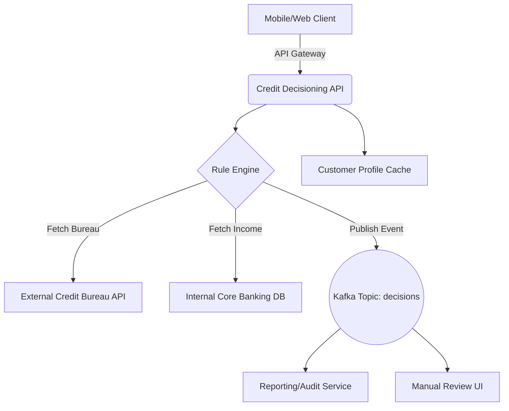

# High-Level Design (HLD): Credit Decisioning Microservice

## 1. System Overview
The Decisioning Microservice evaluates user applications for Credit Line Increases (CLI) and auto-generates underwriting decisions. It ensures sub-second latency for UI-facing calls while maintaining eventual consistency across reporting engines.

## 2. Architecture Diagram (Mermaid)

## 3. Technology Stack
- **Language**: Java / Spring Boot 3
- **Database**: PostgreSQL (Relational schema for configurations and audit logs)
- **Cache**: Redis (For caching bureau scores up to 30 days)
- **Messaging**: Apache Kafka
- **Infrastructure**: Kubernetes (EKS), highly available multi-AZ deployment.

## 4. Key Components
### 4.1 Rule Engine
Evaluates deterministic logic trees configured by business analysts (e.g., `IF income > 50000 AND DTI < 40% THEN APPROVE`).

### 4.2 Data Aggregator
Asynchronously fetches data from external bureaus (Experian/Equifax) and internal ledgers.

### 4.3 Policy Router
Determines the routing of the decision: Auto-Approve, Auto-Decline, or Manual Review.
